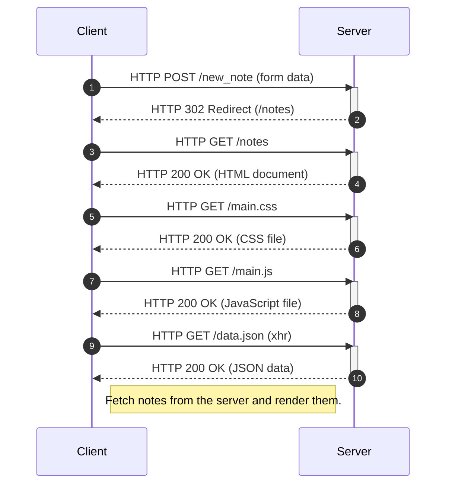
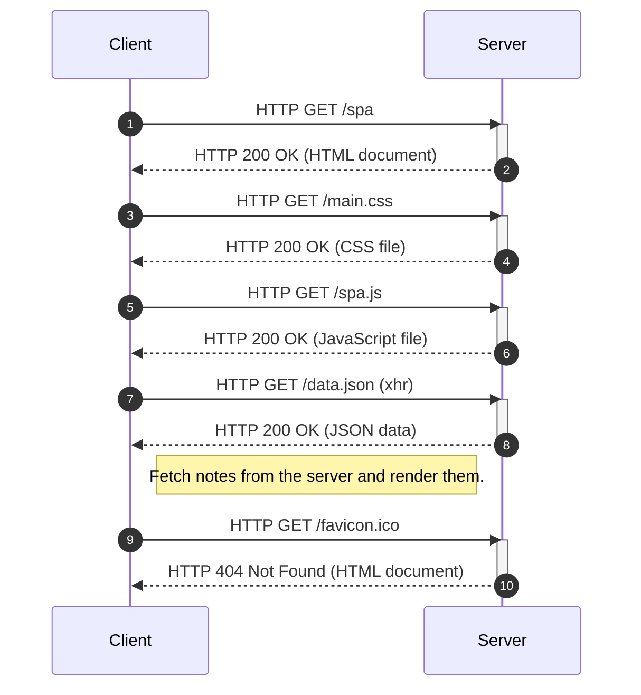
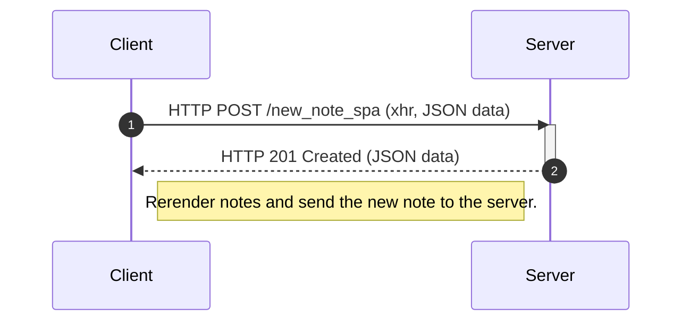

# Exercises 0.1-0.6

Below are my answers to exercises 0.1-0.6.

## 0.1: HTML

Read the *HTML basics* tutorial available at https://developer.mozilla.org/en-US/docs/Learn/Getting_started_with_the_web/HTML_basics.

## 0.2: CSS

Read the *CSS basics* tutorial available at https://developer.mozilla.org/en-US/docs/Learn/Getting_started_with_the_web/CSS_basics.

## 0.3: HTML forms

Read the *Your first form* tutorial available at https://developer.mozilla.org/en-US/docs/Learn/Forms/Your_first_form.

## 0.4: New note diagram

A sequence diagram depicting the situation *after* the user has created a new note and clicked the *Save* button in the Notes app.

Base URL: https://studies.cs.helsinki.fi/exampleapp

## 0.5: Single page app diagram

A sequence diagram depicting the situation where the user has requested the single-page app version of the Notes app.

Base URL: https://studies.cs.helsinki.fi/exampleapp

## 0.6: New note in Single page app diagram

A sequence diagram depicting the situation *after* the user has created a new note and clicked the *Save* button in the single-page app version of the Notes app.

Base URL: https://studies.cs.helsinki.fi/exampleapp

